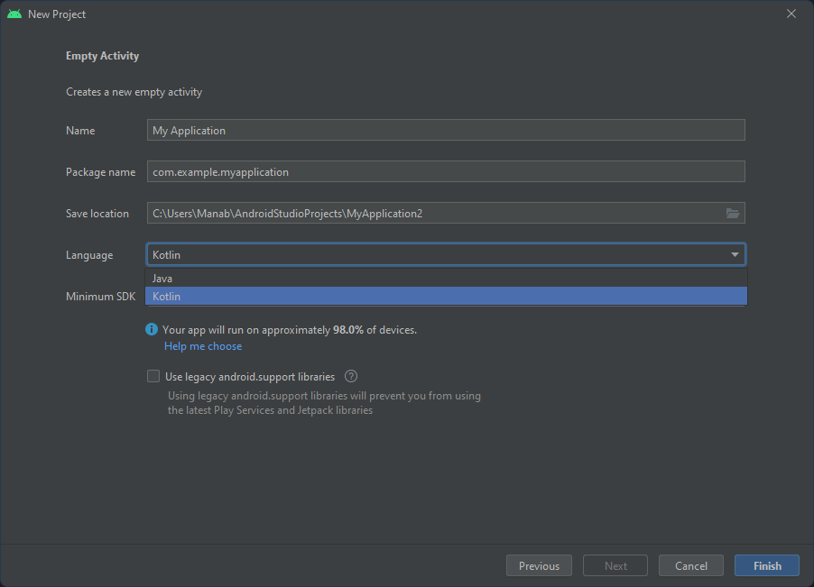
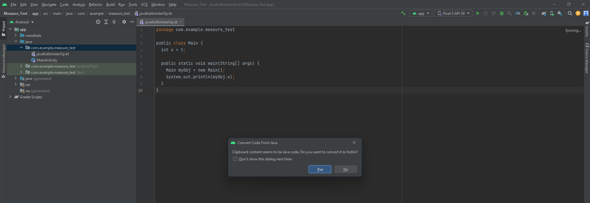

**Java**, alongside a few other frameworks has been the industry standard for building applications that run on multiple platforms - Mobile, PC's, Web Applications and loads more. But, something changed at [**Google I/O 2017**](https://www.google.com/url?sa=t&rct=j&q=&esrc=s&source=web&cd=&cad=rja&uact=8&ved=2ahUKEwjo2abj8eL2AhVPldgFHRJfAmYQwqsBegQIFRAB&url=https%3A%2F%2Fwww.youtube.com%2Fwatch%3Fv%3DCNLVZjBE08g&usg=AOvVaw15-zzYHlOWBwEM2BexVhTH); **Kotlin** was made the officially supported language for Android App Dev. 



Put on your reading glasses, as we take a deep dive into why Kotlin makes your *App Dev* experience smooooooth.

## *Null Safety* 
Let's start off by talking about one of the most infuriated issues Java developers were concerned with : ***Null Pointer Exceptions*** *- Referencing an object with a null value results in a Null Pointer Exception*. All types are *Nullable* in Kotlin by default, which translates to no *Null Pointer Exceptions* !

*Tip: In order to assign a null value to a variable in Kotlin, add a '?' after the data type.*

```
val a: Int? = null
```

## *Concise Code*
Kotlin drastically reduces the need for ***Boilerplate Code*** *- Sections of code that are repeated in multiple places with little/no variation.* This makes your experience a lot less tedious. The best example of code conciseness in Kotlin can be observed in **Classes**.
<br/><br/>

## *Inline and Extension Functions*
Java does provide support for ***Inline Functions*** - *Functions which are expanded in line, when the function is called* (compiler expands using the *final* method). On the other hand, Kotlin provides in-built support for Inline functions.

***Extension Functions*** - *The ability to extend classes with new functions without inheritance or decorators*. These are a tad bit more important and usable, especially when you come from languages such as C#. Sadly, these aren't available in Java.

*Tip: To create an extension function for a previously created class, do the following:*

```
class homeBrew(){
	
	fun fOSS(){
		println("Welcome to your FOSS Home Ground")
	}
	
}

fun homeBrew.entryChallenge(){ 
	
	println("Complete the entry challenge to join us!")
}
```
## *Coroutines*
Android is ***Single Threaded*** by default *- The calling thread is blocked until the operation is complete - the App's UI is completely frozen during this period* and we definitely don't want that happening do we ?
The traditional solution to this in Java would be to create *Background Threads* for intensive work. But, creating multiple threads increases the complexity as well as chances of encountering errors in the code. 

Don't you worry, Kotlin has got you covered. 

Kotlin uses ***[Coroutines](https://developer.android.com/kotlin/coroutines?gclid=EAIaIQobChMIuZamgZPj9gIVz5lmAh19yguWEAAYASAAEgIZA_D_BwE&gclsrc=aw.ds)*** to manage intensive operations. The major advantage compared to Java threads is it's ***Stackless Architecture*** *- They demand lower memory usage compared to threads*. It also provides for the creation of *Non Blocking Asynchronous Code* which appears to be synchronous.
<br/><br/>
## *100% Interoperability with Java*
Kotlin provides for complete interoperability with Java, which means you can use both Kotlin and Java code in the same project and they will compile perfectly. This also gives you the ability to move from Java to Kotlin on a project which you were previously working on.

*Tip: [Android Studio](https://developer.android.com/studio) gives you the ability to convert Java Code to Kotlin or vice versa ! Simply paste Java/Kotlin code onto the IDE and click on the prompt to see the magic happen !!*



*Pro Tip: Android Studio also gives you the ability to decompile Kotlin Code into Java. On the Menu Bar, navigate to **Tools->Kotlin->Decompile Kotlin to Java** and see the magic happen !*


Well, there are tons of other reasons as to why Kotlin should make it to your *Most Used Languages List*, but we'd like to call it an end here. ***Happy reading!***

*Posted by [Manab Kumar Biswas](https://github.com/Manab784)*
